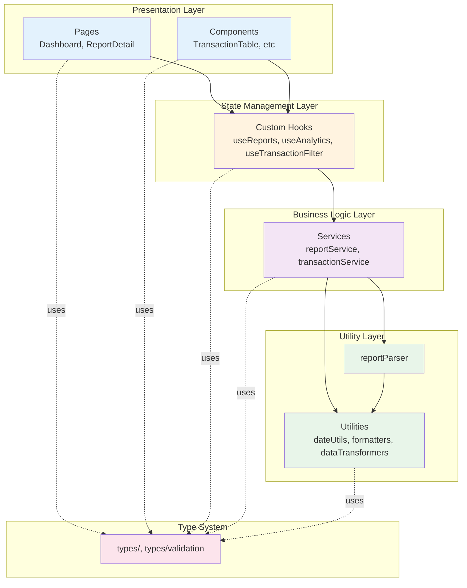
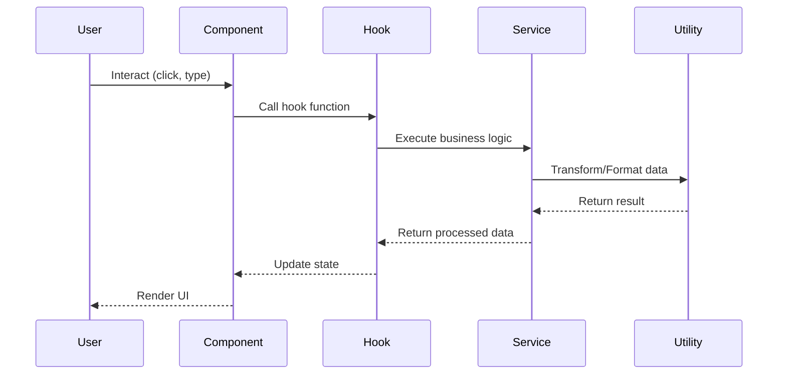
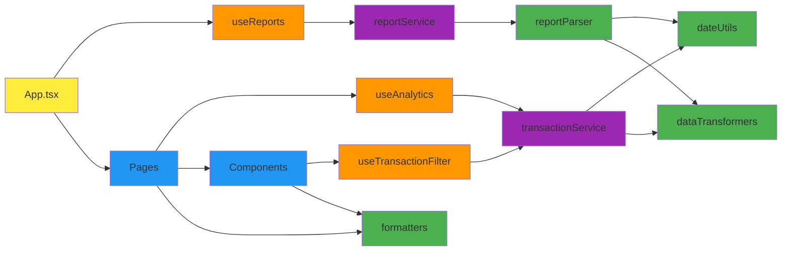

# Intelbiz Architecture Overview

## Layered Architecture

## Data Flow

## Module Dependencies

## Key Principles

### 1. Unidirectional Data Flow
Data flows in one direction: **UI → Hooks → Services → Utilities**

### 2. Separation of Concerns
- **UI Layer**: Presentation only
- **Hooks**: Stateful logic
- **Services**: Business logic
- **Utilities**: Pure functions

### 3. Dependency Inversion
- Components depend on hooks, not services
- Hooks depend on services, not utilities directly
- Services coordinate utility functions

### 4. Single Responsibility
Each module has one clear purpose:
- `dateUtils.ts` - Date operations only
- `formatters.ts` - Formatting only
- `transactionService.ts` - Transaction logic only

## Benefits

 **Testability** - Each layer can be tested independently  
 **Maintainability** - Easy to locate and modify code  
 **Reusability** - Hooks and services can be reused  
 **Scalability** - Easy to add new features  
 **Type Safety** - Strong TypeScript typing throughout
